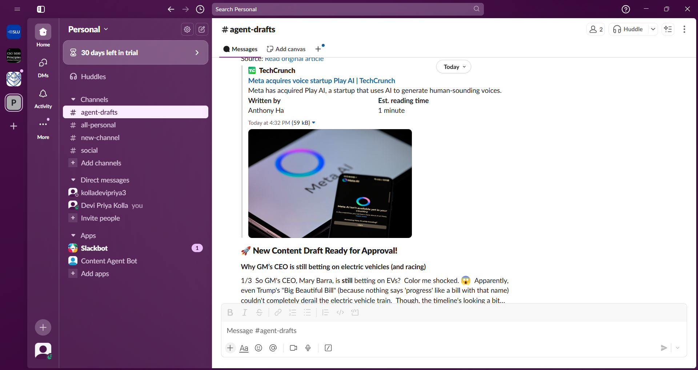

# Autonomous Content Strategist Agent

This project is an intelligent autonomous agent designed to act as a social media content strategist. It automates the entire content discovery and creation pipeline: monitoring news sources, deciding what's important, scraping for context, and drafting on-brand social media content for human approval.

This agent demonstrates a sophisticated `Perceive -> Orient -> Decide -> Act -> Report` loop, making it an excellent example of practical agentic AI.

## Key Features

-   **Intelligent Perception:**
    -   **Multi-Source Monitoring:** Actively monitors a list of user-defined RSS feeds for new content.
    -   **Content Scraping:** Scrapes the source article to get a summary, providing deeper context than a title alone.
-   **Advanced Decision Making:**
    -   **LLM-Powered Relevance Filter:** Uses a fast, low-cost LLM call to decide if an article is "significant" enough to post about, ignoring minor updates or fluff.
    -   **Agentic Memory:** Logs all processed articles (both successful and skipped) in a structured `seen_articles.csv` file to avoid duplicate work and provide a clear audit trail.
-   **Sophisticated Action-Taking:**
    -   **Brand Voice Awareness:** Reads a `brand_voice.txt` file to learn and adopt a specific personality, tone, and formatting for all generated content.
    -   **Automated Content Creation:** Generates multi-part Twitter/X style threads complete with relevant hashtags.
-   **The Handoff Protocol (Notification System):**
    -   **Automated Delivery:** Instead of just printing to a console, the agent dispatches completed drafts directly to configured **Slack** and/or **Discord** channels for final human review and approval.
    -   **Robust & Redundant:** Can be configured to notify multiple platforms simultaneously.
-   **Automated & Reliable Execution:**
    -   **Scheduled Runs:** Designed to be fully automated using **GitHub Actions**, `cron`, or Windows Task Scheduler.
    -   **Rate Limit Handling:** Includes an exponential backoff retry mechanism to gracefully handle API rate limits.

## Demo Output

Here is an example of a notification sent after the agent found, scraped, and processed a relevant article:
### Discord Notification


### Slack Notification

<!-- It's highly recommended to replace this with a real screenshot of your agent's output! -->

## Tech Stack

-   **Language:** Python 3.8+
-   **LLM "Brain":** Google Gemini API (`models/gemini-1.5-flash`)
-   **Core Libraries:**
    -   `google-generativeai`: The official Python client for the Google AI SDK.
    -   `feedparser`: For robust and simple parsing of RSS feeds.
    -   `requests`: For making HTTP requests to scrape articles and send webhook notifications.
    -   `beautifulsoup4`: For parsing HTML content from scraped articles.
    -   `python-dotenv`: To manage environment variables for API keys and webhooks.

## Project Structure

```
/autonomous-content-agent/
|
|-- .github/workflows/run_agent.yml  # GitHub Actions workflow for automation
|-- .venv/                           # Python virtual environment folder
|
|-- .env                             # Stores secret API keys & webhook URLs (ignored by Git)
|-- .gitignore                       # Specifies files for Git to ignore
|
|-- agent.py                         # Main script with the agent's logic
|-- config.py                        # Configuration settings (RSS feeds, file paths)
|-- brand_voice.txt                  # Defines the agent's personality and tone
|
|-- requirements.txt                 # List of required Python libraries
|-- seen_articles.csv                # Structured log of all processed articles
```

## Getting Started

Follow these steps to set up and run the project.

### 1. Prerequisites

-   Python 3.8 or higher.
-   A Google Gemini API key from [Google AI Studio](https://aistudio.google.com/app/apikey).
-   (Optional) A Slack or Discord Webhook URL for notifications.

### 2. Clone the Repository

```bash
git clone https://github.com/your-username/autonomous-content-agent.git
cd autonomous-content-agent
```

### 3. Set Up a Virtual Environment

```bash
# Create the virtual environment
python -m venv venv

# Activate it
# On Windows:
venv\Scripts\activate
# On macOS/Linux:
source venv/bin/activate
```

### 4. Install Dependencies

```bash
pip install -r requirements.txt
```

### 5. Configure the Agent

1.  **Create the `.env` file:** Create a file named `.env` in the project's root folder.
2.  **Add your secrets:** Add your API key and any optional webhook URLs to the `.env` file. Leave a URL blank if you don't want to use that service.
    ```
    GEMINI_API_KEY="Your-Google-API-Key-Here"
    SLACK_WEBHOOK_URL="Your-Slack-Webhook-URL-Here"
    DISCORD_WEBHOOK_URL="Your-Discord-Webhook-URL-Here"
    ```
3.  **Customize RSS Feeds:** Open `config.py` and modify the `RSS_FEED_URLS` list.
4.  **Define Your Brand Voice:** Edit `brand_voice.txt` to describe the personality and formatting rules you want the agent to follow.

### 6. Run the Agent Manually

You are now ready to run the agent for a test!

```bash
python agent.py
```

The agent will check the feeds, process any new and relevant articles, send notifications, and update its `seen_articles.csv` log.

### 7. Automate with GitHub Actions

This project is ready for cloud automation.

1.  Push your code to a GitHub repository.
2.  In your repository's **Settings > Secrets and variables > Actions**, add your `GEMINI_API_KEY`, `SLACK_WEBHOOK_URL`, and `DISCORD_WEBHOOK_URL` as repository secrets.
3.  The workflow defined in `.github/workflows/run_agent.yml` will automatically run every hour. You can also trigger it manually from the "Actions" tab in your repository.